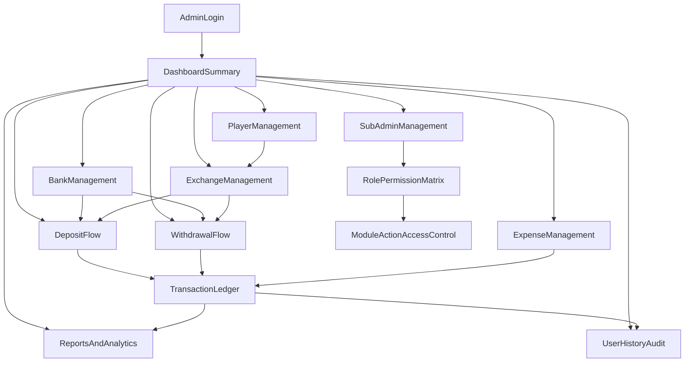

# Client Admin Panel - Reverse Engineering Notes and Module Plan

## 1) Platform Discovery Status

This document is based on live browser walkthrough of the Client Admin Panel sidebar and screens.

Observed directly from UI:
- `Dashboard`
- `Sub Admin` -> `Add Sub Admin`, `Sub Admin List`
- `Exchange` -> `Add`, `List` (menu visible; page navigation appears role-restricted from current login)
- `Player`
- `Bank`
- `Deposit`
- `Withdrawal`
- `Reports`
- `User History`

Observed from `Add Sub Admin` permission matrix (important source of full module map):
- Dashboard
- Exchange -> Add Exchange, Edit Exchange, List
- Players -> Add, Edit, Csv File Players, List
- Banks -> Add, Edit, List, Statment
- Deposit -> Banker, Banker Edit, Banker Deposit List, Exchang Deposit, Final Deposite View, Final Deposit Edit
- Withdrawal -> Exchang Withdrawal, Exchang Edit, Exchange Withdrawal List, Banker Withdrawal List, Banker Withdrawal, Final Withdrawal View, Final Withdrawal Edit
- Expensives -> Master List, Add, Edit, List

Observed routes:
- `#/dashboard`
- `#/user-history`
- `#/add-subadmin`
- `#/subadmin-list`
- `#/add-exchange`
- `#/exchange-list`
- `#/add-player`
- `#/add-bank`
- `#/bank-list`
- `#/statement`
- `#/banker-deposit`
- `#/withdrawal-final-list`

## 2) Complete Module Inventory (Consolidated)

### Core
- Dashboard
- Sub Admin
- Exchange
- Player
- Bank
- Deposit
- Withdrawal
- Reports
- User History
- Expensives (from permission matrix)

### Sub-module / action level
- Sub Admin: Add Sub Admin, Sub Admin List, Update Password, Edit
- Exchange: Add Exchange, Edit Exchange, List
- Player: Add, Edit, CSV Import, List
- Bank: Add, Edit, List, Statement
- Deposit: Banker, Banker Edit, Banker Deposit List, Exchange Deposit, Final Deposit View, Final Deposit Edit
- Withdrawal: Exchange Withdrawal, Exchange Edit, Exchange Withdrawal List, Banker Withdrawal List, Banker Withdrawal, Final Withdrawal View, Final Withdrawal Edit
- Expensives: Master List, Add, Edit, List
- User History: Date filter, text search, pagination
- Reports: Financial/transaction summaries (exact report types to validate in next pass)

## 3) Business Flow (High-Level)

## 4) Entity and Process Model (Reverse-Engineered)

Primary entities:
- Admin User / Sub Admin
- Permission (module + action)
- Player
- Bank Account
- Exchange Entry
- Deposit Transaction
- Withdrawal Transaction
- Expense Entry
- Audit/Event History

Likely status flows to implement:
- Deposit: Draft/Pending -> Verified -> Finalized
- Withdrawal: Requested/Pending -> Approved/Rejected -> Finalized
- Exchange: Created -> Edited/Reviewed -> Listed/Settled

## 5) Frontend Implementation Plan (Module-wise)

### Phase A - Foundation
- Create route map for all discovered modules/submodules.
- Build reusable table shell: search, date filter, pagination, page-size.
- Build reusable form shell: validation, required field state, submit/cancel actions.
- Add shared permission guard utility (hide/disable module actions by permission key).

### Phase B - Admin and Master Data
- Sub Admin: Add form + list + update password + edit.
- Player: add/edit/list/CSV import UX.
- Bank: add/edit/list/statement view.

### Phase C - Financial Flows
- Exchange: add/edit/list.
- Deposit: banker workflow + exchange deposit + final view/edit.
- Withdrawal: exchange + banker + final view/edit workflows.

### Phase D - Control and Visibility
- Reports: summarized and drill-down views.
- User History: activity feed with filters/search/pagination.
- Expensives: master/add/edit/list.

### Phase E - Hardening
- Role-based rendering and action-level locks.
- Loading/error/toast consistency across modules.
- E2E happy-path and failure-path coverage.

## 6) Backend Implementation Plan (Module-wise)

### Platform layer
- Auth/session, user profiles, password update.
- RBAC with permission keys aligned to module actions in sidebar matrix.

### Domain services
- Sub Admin service (CRUD + credentials + permission assignment)
- Player service (CRUD + CSV ingestion)
- Bank service (CRUD + statement APIs)
- Exchange service (create/edit/list and settlements)
- Deposit service (banker/exchange/finalization pipeline)
- Withdrawal service (exchange/banker/finalization pipeline)
- Expense service (master/add/edit/list)
- History/Audit service (event capture + filtered retrieval)
- Reports service (aggregated financial metrics, date-range endpoints)

### Data & integrity
- Transaction-safe ledger updates for deposit/withdrawal/expense/exchange adjustments.
- Status transition validation rules (no illegal jumps).
- Audit logging on all privileged actions (edit, finalize, password update, permission changes).

## 7) API Contract Strategy

- Standard list query contract: `page`, `pageSize`, `search`, `fromDate`, `toDate`, `sortBy`, `sortOrder`.
- Standard response envelope for list and detail APIs.
- Standard error model with validation field map for form UIs.
- Module-wise OpenAPI spec to freeze FE/BE integration early.

## 8) Delivery Sequence

1. Freeze this module list and permission taxonomy.
2. Confirm each hidden/role-restricted route with an elevated admin login.
3. Define API contracts (OpenAPI) for each module.
4. Implement backend services in vertical slices (Sub Admin -> Master Data -> Financial Flows -> Reports/History).
5. Implement frontend in same slice order for continuous integration.
6. Run integration + UAT on complete end-to-end financial lifecycle.

## 9) Gaps to Validate in Next Browser Pass

- Exact page routes and fields for Exchange/Player/Bank/Deposit/Withdrawal/Reports/Expensives.
- Report types and export capabilities.
- Exact status names and state transitions for deposit/withdrawal/exchange.
- Whether duplicate labels (`Exchang Deposit`) represent separate steps or naming duplication.

## 10) Detailed Screen-by-Screen Reverse Engineering

This section captures what is visible in each opened screen from the browser walkthrough.

### Dashboard (`#/dashboard`)
- Widgets: Full Day Summary.
- Summary cards/metrics visible: Deposit, Withdrawal, Total Bonus (D/W), Gross Profit & Loss, New Clients.
- Dashboard appears to be operational KPI landing page.

### Sub Admin - Add (`#/add-subadmin`)
- Form fields: Email, Full Name, Username, Password, Confirm Password.
- Actions: Save, Cancel.
- Permission matrix is embedded in this screen and is very important:
  - Dashboard
  - Exchange: Add Exchange, Edit Exchange, List
  - Players: Add, Edit, Csv File Players, List
  - Banks: Add, Edit, List, Statment
  - Deposit: Banker, Banker Edit, Banker Deposit List, Exchang Deposit, Final Deposite View, Final Deposit Edit
  - Withdrawal: Exchang Withdrawal, Exchang Edit, Exchange Withdrawal List, Banker Withdrawal List, Banker Withdrawal, Final Withdrawal View, Final Withdrawal Edit
  - Expensives: Master List, Add, Edit, List

### Sub Admin - List (`#/subadmin-list`)
- Controls: Page size, Search.
- Row actions observed: Update Password, Edit.
- Pagination enabled.

### Exchange - Add (`#/add-exchange`)
- Fields: Exchange Name, Opening Balance, Bonus, Exchange Provider (search/select), Status.
- Actions: Save, Cancel.

### Exchange - List (`#/exchange-list`)
- Controls: Page size, Search.
- Table/actions: update/edit style action button(s), `E2E` action buttons on rows.
- Additional inline forms/modals visible:
  - Update Exchange (Exchange Name, Opening Balance, Bonus, Exchange Provider, Status)
  - Exchange to Exchange Transfer (From Exchange Name, To Exchange Name, Amount)
- Pagination enabled.

### Player - Add (`#/add-player`)
- Screen title observed as Add Exchange Player (player onboarding mapped to exchange).
- Fields: Exchange, Player ID, Phone Number, Player Excel file.
- Actions: Save, Cancel.
- Also observed an additional readonly `id` field section with Save/Cancel (likely CSV/bulk helper area).

### Bank - Add (`#/add-bank`)
- Fields:
  - Bank Holder Name, Bank Name, Account Number, IFSC, Limit, Opening Balance
  - Status (Active/Deactive)
  - Edit (No. of D/W) (Editable/Not Editable)
  - Bank Type (Deposit/Withdrawal)
- Actions: Save, Cancel.

### Bank - List (`#/bank-list`)
- Controls: Page size, Search.
- Row actions:
  - Edit Bank
  - B2B (bank-to-bank transfer)
  - Expense
  - Update (No. of D/W)
- Extra workflows on same screen:
  - Bank to Bank Transfer form (Bank Holder Name, From Account Number, Bank Name, UTR, Amount)
  - Add Expense form (Bank Holder Name, Account Number, Expense Name, UTR, Amount)
  - Update No. of Count (Deposit/Withdrawal)
- Pagination enabled.

### Bank - Statement (`#/statement`)
- Filters:
  - From Bank Name, To Bank Name
  - From Date, To Date
  - UTR search
  - Submit
- Table controls: page size, pagination.
- Row action observed: Edit Statement.

### Deposit - Banker Deposit (`#/banker-deposit`)
- Input form: Bank Name, UTR, Amount.
- Actions: Save, Clear.
- List section title: Depositer Exchanger.
- Controls: Search by UTR, page size, pagination.
- Row action observed: Banker Update.
- Sidebar shows additional deposit menus:
  - Exchange Depositors
  - Final List
  (not fully navigable under current account state in this pass)

### Withdrawal - Final List (`#/withdrawal-final-list`)
- Filters: Player Name, Bank Name, From Date, To Date, Search, Submit.
- Table controls: page size, pagination.
- Action/button: Excel (disabled in current state).
- Edit panel visible: Edit Final Withdrawal with fields:
  - Player Name, Exchange, Account Number, Account Holder Name
  - Bank Name, IFSC, Withdrawal Bank Name, UTR, Amount, Bonus, Remark

### Reports (module behavior seen)
- Reports expands and shows Transaction History submenu.
- In current role/session, reports click landed on `withdrawal-final-list` context, indicating shared/linked reporting view or permission-constrained routing.
- Need elevated access to confirm standalone transaction history route/screen.

### User History (`#/user-history`)
- Filters: From Date, To Date, Search, Submit.
- Controls: page size, pagination.
- Primary use: audit trail of user/admin activity.

### Cross-screen Global Utility
- Update Password modal is globally present in multiple screens:
  - Master Password
  - User New Password
  - Confirm Password

## 11) Route/Permission Notes From Walkthrough

- This product uses role-permission based menu exposure and route behavior.
- Some menu clicks only highlight submenu but do not change route unless specific nested item is clicked.
- Certain menu entries appear visible but do not navigate for the current user (likely missing permission bindings).
- The permission matrix in Add Sub Admin is currently the most reliable source for full module/action inventory.

## 12) Standard Baseline Enhancements (Non-Major)

These are standard operations expected for this product type and can be added without major redesign.

### A) Data Quality and Form Hygiene
- Apply common form rules across all create/edit screens: required checks, max lengths, numeric precision.
- Add domain validation packs:
  - IFSC format validation.
  - Account number length/character validation.
  - UTR format and uniqueness (scope by bank/module as required).
  - Amount must be positive and within configured limits.
- Standardize inline error rendering from backend validation response:
  - Field errors map directly to form inputs.
  - Non-field errors shown in a form-level alert area.
- Prevent duplicate submit:
  - disable submit while request is running;
  - reject duplicate request with idempotency key for financial writes.

### B) List, Search, and Pagination Consistency
- Standardize list query inputs on every list/report page:
  - `search`, `fromDate`, `toDate`, `page`, `pageSize`, `sortBy`, `sortOrder`.
- Persist list filters in URL query params for reload-safe views.
- Add table empty-state and no-result messaging consistently.
- Keep default page size and available page-size options uniform.

### C) Transaction Safety
- Enforce workflow status transitions:
  - Deposit: `pending -> verified -> finalized`.
  - Withdrawal: `requested -> approved/rejected -> finalized`.
  - Exchange: `created -> reviewed -> settled`.
- Add explicit confirmations for sensitive actions:
  - finalize, reverse, force edit, password update.
- Add correction flow instead of silent overwrite:
  - `reverse` or `adjust` with mandatory reason.
- Add optimistic concurrency on updates (`version` or `updatedAt` check).

### D) Auditability
- Add audit events for privileged actions:
  - create/edit/delete/finalize/reverse/export/password/permission updates.
- Persist audit payload with:
  - actor, action, entity, oldValue, newValue, reason, timestamp, requestId.
- Make User History and Transaction History exportable for compliance review.

### E) Access and Security Baseline
- Normalize permission keys by module+action and enforce in both:
  - UI visibility/action enablement;
  - API authorization middleware.
- Add inactivity timeout + sensitive-operation re-auth guard.
- Add password policy baseline:
  - minimum length and complexity;
  - confirm-password mismatch prevention;
  - optional recent-password reuse guard.

### F) Reporting and Operations Usability
- Enable export (CSV/Excel) for major financial tables where currently partial/disabled.
- Add totals row on filtered financial tables:
  - amount sum, record count, bonus sum where applicable.
- Add print-friendly report layout for end-of-day review.

### G) Reliability and Observability
- Standardize backend error classes:
  - `validation_error`, `business_rule_error`, `auth_error`, `system_error`.
- Add correlation/request IDs in transaction APIs and logs.
- Add basic health endpoints and alert hooks for failed financial writes.

## 13) Module-Wise Enhancement Checklist (FE + BE + QA)

### Priority 1 - Financial Flows (implement first)

#### Exchange (`add-exchange`, `exchange-list`)
- FE: validate exchange name/provider/amount fields; disable duplicate submit; add confirm before transfer.
- BE: enforce provider existence and transfer rules; prevent negative/zero amounts; write audit events.
- QA: invalid amount, duplicate submit, unauthorized edit, transfer race-condition checks.

#### Deposit (`banker-deposit`, exchange depositors/final list)
- FE: strict UTR/amount validation; standard filter bar; finalize confirmation dialog.
- BE: valid status transitions and idempotent create/finalize APIs; banker permission checks.
- QA: transition rule tests (`pending->finalized` direct should fail), duplicate UTR handling.

#### Withdrawal (`exchange withdrawal`, `banker withdrawal`, `withdrawal-final-list`)
- FE: mandatory fields in final edit form; reason required for correction/reversal.
- BE: approval/reject/finalize transitions; reversal endpoint with reason; audit for every state change.
- QA: rejection/finalization integrity, excel export behavior, permission denial matrix.

#### Bank (`add-bank`, `bank-list`, `statement`)
- FE: IFSC/account validation; B2B and expense form constraints; clear empty states.
- BE: statement query with filters+pagination+sort; bank edit concurrency checks.
- QA: statement filters/date edge cases, B2B amount limits, count update constraints.

#### Reports (`transaction history` and linked financial reports)
- FE: normalized date/search filters; export enabled state and disabled-state messaging.
- BE: aggregated endpoints with totals; report export API with permission checks.
- QA: totals accuracy, date-range boundary checks, export authorization.

### Priority 2 - Controls and Audit

#### User History (`user-history`)
- FE: keep filters/shareable URLs and improve search feedback.
- BE: add event category filters and stable sorting.
- QA: event visibility by role and timestamp ordering.

#### Sub Admin (`add-subadmin`, `subadmin-list`)
- FE: permission matrix UX clarity (grouped and searchable).
- BE: canonical permission key map and API-side enforcement.
- QA: role matrix tests for hidden routes and blocked actions.

### Priority 3 - Shared Foundations
- Shared FE form engine for validations/error mapping.
- Shared FE table wrapper for list/query state and pagination.
- Shared BE response/error envelope and query parser middleware.
- Shared audit logger utility with requestId propagation.

## 14) Acceptance Test Checklist (Implementation Ready)

### Validation and Data Integrity
- [ ] Required fields fail fast with clear messages on every create/edit screen.
- [ ] Financial amount fields reject zero/negative/non-numeric values.
- [ ] UTR uniqueness constraints enforced where required.
- [ ] IFSC/account format validation works for add/edit bank flows.

### Permissions and Access
- [ ] UI hides unauthorized module actions based on role.
- [ ] APIs reject unauthorized actions even if route is directly called.
- [ ] Sub-admin permission updates reflect immediately after re-login/session refresh.

### Transaction Safety
- [ ] Invalid status transitions are rejected by API.
- [ ] Duplicate submit does not create duplicate financial entries.
- [ ] Finalize/reverse/edit sensitive actions require confirmation.
- [ ] Concurrent edit conflict returns safe error and does not overwrite silently.

### Audit and Traceability
- [ ] Every privileged action creates audit log with actor and before/after values.
- [ ] User history supports date filter, search, pagination with correct ordering.
- [ ] Exported audit/report data matches on-screen filtered data.

### Reporting and Operations
- [ ] Major financial lists support export and totals rows.
- [ ] Date-range filters are consistent across Exchange/Deposit/Withdrawal/Reports/Statement.
- [ ] Empty-state and no-result states are clear and actionable.

### Reliability
- [ ] Standard error envelope is returned for validation/business/system failures.
- [ ] Request/correlation IDs are present in transaction logs.
- [ ] Health endpoint reports service readiness and dependency status.

---

This is the working blueprint for starting frontend and backend implementation.
